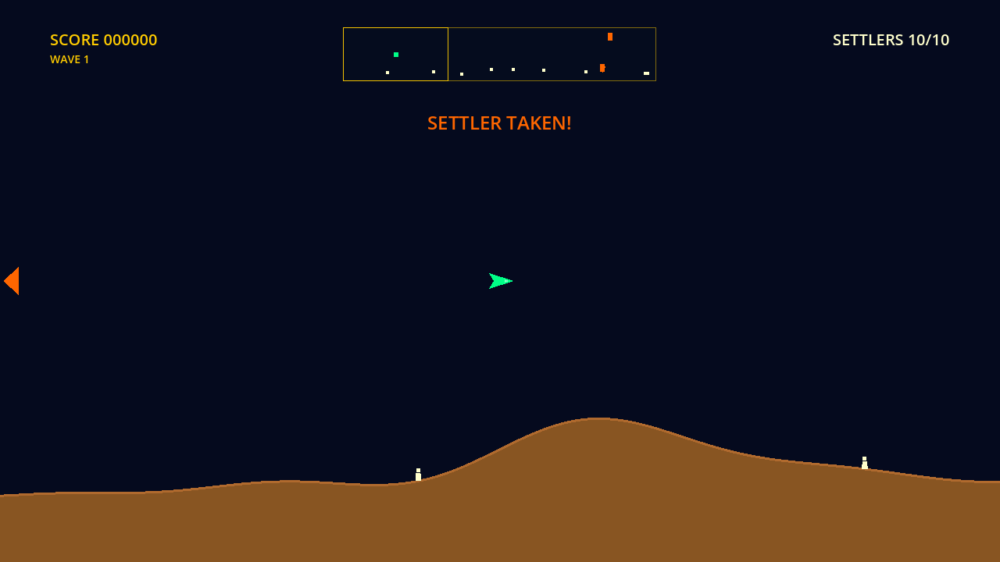

# FYTR9

A fast, single-player panoramic rescue shooter — pilot the experimental
FYTR-9 craft around a continuously looping neon planet, destroy hostile
aircraft, and rescue Settlers from abduction before they're carried away.

**Status: pre-alpha.** The core rescue loop is playable — Snatchers abduct
Settlers, you shoot the carrier, catch the falling Settler, and return it to
the surface. Lives, bombs, hyperspace, and the full enemy roster are next.
Built with Godot 4.7 in GDScript, targeting Web, Windows, macOS, and Linux.

The authoritative implementation plan is [`fytr9-plan-v4.md`](fytr9-plan-v4.md).



## What's playable right now

The **Milestone 2 rescue vertical slice**, one full wave of the real game:

- Ten **Settlers** walk the terrain of a seamless looping world (three
  screens wide — crossing the "seam" is invisible by design).
- Four **Snatchers** spawn over the wave and hunt the nearest Settler by
  shortest wrapped route: reserve, descend, grab, ascend. Reach the top and
  the Settler is gone (mutated — the Ravager it becomes arrives in M4).
- **Shoot the carrier** and the Settler falls: catch it by flying into it,
  then carry it down into the safe band above the terrain to deliver it.
  Short unaided falls are survivable; long drops are lethal.
- The **scanner** shows the whole ring — every contact, your viewport
  bracket (seam-aware), abductions, and falls. Off-screen trouble also gets
  a directional edge arrow pointing the short way around.
- **Scoring** per the plan: 150 per Snatcher, 250 a catch, 750 a delivery,
  plus wave-clear, survivor, and perfect-population bonuses.
- Clear the wave (or lose every Settler) → instant retry with a fresh seed.

### Quick start

1. Install **Godot 4.7 stable** (macOS: `brew install --cask godot`; other
   platforms: [godotengine.org](https://godotengine.org/download/)).
2. Clone and run:

```bash
git clone https://github.com/charles-hood/fytr9.git
cd fytr9
godot --path project
```

3. On the title screen, press **fire** (Space / J / gamepad south) to launch
   the flight lab.

### Controls (defaults, keyboard or gamepad)

| Action | Keyboard | Gamepad |
|---|---|---|
| Move | WASD or arrows | Left stick or D-pad |
| Fire (Arc Lance) | Space or J | South button or right trigger |
| Pulse Bomb *(not yet implemented)* | E or K | West button or left trigger |
| Hyperspace *(not yet implemented)* | Q or L | North button or right shoulder |
| Pause / back to title | Escape or P | Start |
| Debug overlay | F3 | — |

### Pre-alpha playtest notes — what feedback helps most

- **Flight feel**: does thrust, coasting, and the quick brake-and-reverse
  feel good at speed? (Targets: ~3.2 s to cross a screen, ~0.6 s full
  reversal.)
- **Arc Lance**: does firing while chasing feel punchy or sluggish? (Known
  watch item: shots travel at only 2× ship speed.)
- **Rescue clarity**: when a Settler is taken off-screen, do the banner,
  scanner, and edge arrow get you there in time? Is catching a falling
  Settler readable and fair (catch radius), and is delivering it obvious?
- **Pacing**: one wave = 4 Snatchers, max 1 abduction at a time. Too calm,
  too frantic?
- **Seam**: fly one direction for ~10 s — you'll lap the world. Any visible
  pop, stutter, or double-hit anywhere?
- **Camera**: the view leads your movement direction — too much, too little?

All tuning values live in `project/resources/balance/*.tres` — nothing is
hard-coded.

## Development status

| Milestone | Scope | Status |
|---|---|---|
| 0 — Repository & foundation | Project, input, tests, docs, licenses | ✅ done |
| 1 — Flight laboratory | Ring world, flight model, Arc Lance, terrain, camera, debug | ✅ done (feel check in progress) |
| 2 — Rescue vertical slice | Settlers, Snatcher, catch/carry/return, scanner, first wave | ✅ done |
| 3 — Complete arcade loop | Lives, Pulse Bomb, hyperspace, waves 1–5, difficulty presets | ⬅ next |
| 4 — Full roster & planet cycle | Ravager, Mine Layer, Brood Pod, Splinter, Interceptor, planet collapse/restoration | pending |
| 5 — Presentation, saves, accessibility | Menus, saves, options, art & SFX pass | pending |
| 6 — Balance & release candidate | Playtests, tuning, exports, license audit | pending |

### Next up (Milestone 3 — complete arcade loop)

1. Lives, player death (terrain and enemies become lethal), respawn safety
   and invulnerability; Snatcher aimed shots arrive with them.
2. Pulse Bomb (run-level resource — not refilled on death).
3. Hyperspace with the per-difficulty failure roll.
4. Waves 1–5 from the plan's recipe table, extra-life thresholds,
   high-score foundation, and the three difficulty presets.
5. Wave transitions hardened against simultaneous events (death + clear +
   bomb + falling Settler in the same tick).

## Engine (pinned)

- **Godot 4.7.stable.official.5b4e0cb0f** (Homebrew cask `godot` 4.7)
- Renderer: **Compatibility** (`gl_compatibility`); GDScript only
- Logical resolution: 1280×720, 16:9
- **Export templates:** download the matching **4.7.stable** templates before
  Milestone 6 (Editor → Manage Export Templates). An editor/template version
  mismatch is a silent-failure trap.

## Repository layout

- `project/` — the Godot project (open this directory in the editor)
- `project/docs/DECISIONS.md` — recorded implementation decisions
- `project/docs/BACKLOG.md` — post-v1 ideas (never built in v1)
- `project/resources/balance/` — all tuning values, as Godot resources
- `project/licenses/` — asset manifest and third-party notices
- `run_checks.sh` — full test suite plus a headless boot smoke test

## Tests and verified CLI commands

Verified against this exact build's `godot --help` output (per plan §12):
`--headless`, `--path`, `--script`, `--quit-after <int>`, `--check-only`, and
`--import` are all present in 4.7.stable.official.5b4e0cb0f.

```bash
./run_checks.sh                # everything: import, tests, boot smoke
godot --headless --path project --script res://tests/test_runner.gd   # tests only
godot --headless --path project --quit-after 3                        # boot smoke
```

Current suite: 13 suites, 1071 checks — ring math, terrain continuity, RNG
stream isolation, flight envelope, Settler state machine and reservations,
Snatcher lifecycle, scanner mapping, scoring rules, and end-to-end rescue
simulation through the real session scene.

## License

Code is MIT (see `LICENSE`). Asset licensing is tracked in
`project/licenses/` and `project/CREDITS.md`.
